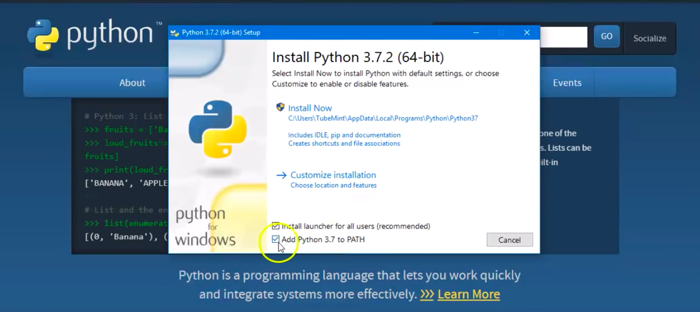

# Project Description

### CSC305 group s19p1j
SalmonBot is a personal assistant program that allows a user to complete daily productivity tasks, like finding the weather, getting the time, viewing popular social media posts, and setting/viewing events on a calendar. There are also several distractions and diversions in the program for the user to play around with.

### Installation

In order to intall the program the following steps need to be followed-

  - first you will need to install python from the web site it can be obtained from the website, version 3.7 or greater is required-

    https://www.python.org/downloads/

**Note: This Program is currently only supported for Windows operating systems. Mac users can try and figure out how to install the dependencies on their machine, but automatic installation is not supported for Mac at this time.**

  - once the download is complete run the installer, **it is very important to select the "ADD PATH" in the install screen as seen in this screenshot**.-

  - Git must also be installed in order to properly install the program, the download can be found here:
  - https://git-scm.com/downloads
  

  - once Python is installed the setup.bat must be ran in order to install the rest of our needed downloads-

  - once that is complete you will be able to run the MenuApp python file

In order to receive the best experience from our application we encourage the use of our many features-

| feature name | user |
| ------ | ------ |
| Fishing | Enjoy a nice fishing experience, Have fun discovering all the fish available! |
| Pizza | Need to order a pizza from the comfort of your own basement? Go ahead! We have you covered|
| Twitter | Look at your feed inside our program for better conveniance. |
| Weather | Get the datails on the current weather for your preferred location. |
| Calandar | Life can be hard to manage. Let us help with your busy life by keeping track of your events. Birthdays, anniversaries, funerals!!!, the posibilities are endless! |
| News | Be up to date with impoertant world events, this weeks most recent tragedy, what celebrity is in hot water, and what did the president say this time? All can be answered with our program! |
